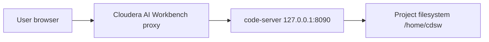

# Cloudera Blueprint: VS Code on Cloudera AI

Custom ML runtime for **Cloudera AI Workbench / CML** that launches **VS Code in the browser** via [code-server](https://github.com/coder/code-server).

## Table of Contents

- [Overview](#overview)
- [Demo](#demo)
- [Use Case](#use-case)
- [Key Features](#key-features)
- [Quickstart](#quickstart)
- [Architecture / Software Components](#architecture--software-components)
- [Target Audience](#target-audience)
- [Repository Structure](#repository-structure)
- [Prerequisites](#prerequisites)
- [Hardware Requirements](#hardware-requirements)
- [Documentation](#documentation)

## Overview

This blueprint packages a **browser-based VS Code editor** as a Cloudera AI **custom runtime**, so data scientists and engineers can edit project code, use the integrated terminal, and install extensions without leaving the workbench. It builds on the standard **PBJ Workbench Python 3.13** image and follows the same `code-server` pattern as [Cloudera community VS Code runtimes](https://github.com/cloudera/community-ml-runtimes/tree/main/vscode). Sessions expose the VS Code editor when `ML_RUNTIME_EDITOR=VsCode` is set on the image.

## Demo

Recorded walkthrough: _coming soon._


## Use Case

Teams on Cloudera AI Workbench often need a full IDE—multi-file editing, Git, refactoring, and terminal workflows—not only notebooks. This blueprint delivers that experience inside the platform’s session proxy and project filesystem, so developers stay on governed infrastructure while using familiar VS Code tooling.

**Primary outcome:** Faster iteration on CML projects with VS Code as the default session editor.

## Key Features

- **In-browser VS Code** via code-server, proxied through the workbench like JupyterLab
- **Python 3.13 PBJ Workbench** base with standard kernel and workbench tooling
- **Integrated terminal** in the project workspace (`/home/cdsw`)
- **Custom runtime metadata** so the catalog offers **VS Code** as the session editor
- **Optional pre-built image** for quick catalog registration without a local build

## Quickstart

1. **Clone the repository** (or skip build and use the pre-built image below).

2. **Register the runtime** in **Admin → Runtime Catalog → Add Runtime**.

   **Fast path** — use the published image:

   ```text
   kevintalbert/vscode-runtime:latest
   ```

   **Custom build** — when you need a different PBJ base tag or extra packages:

   ```bash
   docker build --platform linux/amd64 --pull --rm \
     -f Dockerfile \
     -t <your-registry>/vscode-cloudera-ai:1.0.0 .

   docker push <your-registry>/vscode-cloudera-ai:1.0.0
   ```

   Register your registry URL in the runtime catalog. The image sets `ML_RUNTIME_EDITOR=VsCode` so sessions offer VS Code instead of JupyterLab.

   **Base image:** `ml-runtime-pbj-workbench-python3.13-standard:2026.08.1-b5`. If your cluster uses a different maintenance build, update the `FROM` line in `Dockerfile` to match your platform’s PBJ Workbench tag.

3. **Start a session** with this runtime on a CML project.

4. **Open VS Code** from the workbench UI and work in the project tree; install extensions from the Open VSX marketplace as needed.

Optional environment variable: `CODE_SERVER_BIND` (default `127.0.0.1:8090`).

### Troubleshooting

| Issue | Fix |
| --- | --- |
| Editor does not appear in UI | Confirm the runtime is registered and `ML_RUNTIME_EDITOR=VsCode` is set on the image. |
| Port / proxy errors | Ensure nothing else binds port `8090` in the session; restart the session and reopen the editor. |
| Extension install fails | Some Marketplace extensions require a manual VSIX install; prefer Open VSX-compatible extensions in code-server. |

## Architecture / Software Components

| Component | Role |
| --- | --- |
| **Cloudera AI Workbench** | Hosts CML sessions, proxies the editor URL to the user |
| **Custom runtime image** | Extends PBJ Workbench with code-server and `ml-runtime-editor` entrypoint |
| **code-server** | VS Code in the browser, bound to `127.0.0.1:8090` inside the session pod |
| **PBJ Workbench (Python 3.13)** | Base ML runtime (kernels, Spark/Hadoop client libraries per base image) |



## Target Audience

- **Data scientists and ML engineers** who prefer VS Code over JupyterLab for day-to-day coding
- **Platform / ML admins** who curate custom runtimes in the CML catalog
- **Solution architects** evaluating IDE-style workflows on Cloudera AI

## Repository Structure

| Path | Description |
| --- | --- |
| `Dockerfile` | PBJ Workbench base, code-server install, Cloudera runtime labels and env |
| `scripts/vscode-launch.sh` | `ml-runtime-editor` entrypoint: starts code-server |
| `METADATA.yaml` | Catalog metadata for the Cloudera blueprint website |
| `.dockerignore` | Docker build context exclusions |

## Prerequisites

- **Cloudera AI Workbench (CML)** with permission to add **custom runtimes** to the catalog
- **Docker** on a linux/amd64 build host with pull access to `docker.repository.cloudera.com` (for custom builds)
- **Container registry** you can push to and that your cluster can pull from (for custom builds; not required for `kevintalbert/vscode-runtime:latest`)
- **Git** to clone this repository (optional if using the pre-built image only)

## Hardware Requirements

Sizing follows normal CML **session** resources for Python workbench workloads. No GPU is required for the editor itself.

| Deployment | Minimum |
| --- | --- |
| **Launchable / demo** | 2 vCPU, 8 GiB RAM, 10 GiB session storage (typical small dev session) |
| **Production / team use** | Match your org’s CML session standards for Python 3.13 projects (scale with concurrent users and workload, not the editor alone) |

## Documentation

- [Cloudera community ML runtimes — VS Code](https://github.com/cloudera/community-ml-runtimes/tree/main/vscode) — upstream patterns for code-server on CML
- [code-server documentation](https://coder.com/docs/code-server/latest)
- [Cloudera Machine Learning](https://docs.cloudera.com/machine-learning/cloud/) — product documentation (runtime catalog, sessions, projects)
